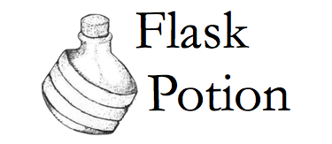

Flask-Potion
============

**Flask-Potion** is a powerful Flask extension for building RESTful JSON APIs.
Potion features include validation, model resources and routes, relations, object permissions, filtering, sorting,
pagination, signals, and automatic API schema generation.

Potion ships with backends for SQLAlchemy, peewee and MongoEngine models.
It is possible to add backends for other data stores, or even to use a subset of Potion without any data store at all.

User's guide
------------

.. toctree::
   :maxdepth: 2

   installation
   quickstart
   fields
   filters
   api
   routes
   resources
   managers
   signals

   permissions
   recipes

